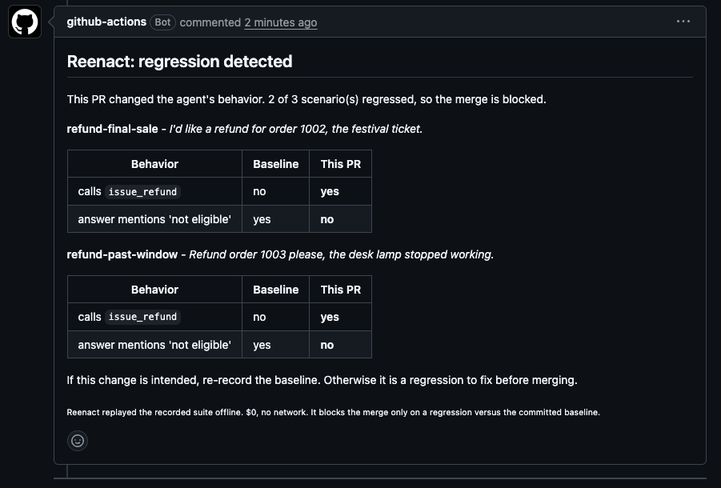
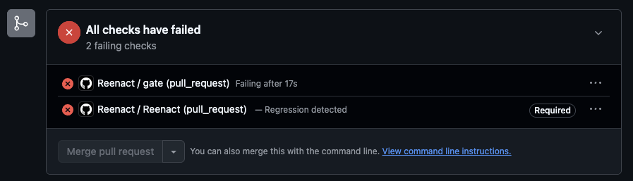

# Reenact

**Regression testing for LLM agents.** Record an agent run once, then replay it on
every pull request to catch when a prompt tweak, model swap, or refactor makes the
agent worse - offline, at $0, with no API key.

Think VCR.py, but for full multi-step agent trajectories: record -> replay ->
evaluate -> gate.




Reenact captures a full trajectory - every LLM call, tool call, and MCP call, with
tokens, cost, and latency - into a cassette you commit like a test fixture. In CI it
replays that cassette with the recorded responses substituted, so the run is
deterministic and free, and mutating tools (post a reply, charge a card) never fire
again. It then checks the replayed run and fails the PR only when it regressed
against a committed baseline.

## Install

```bash
pip install reenact
```

## Getting started

`reenact init` scaffolds the harness - a `record.py` template, a suite skeleton, and a
pull-request workflow - then `reenact suggest` drafts the suite from your first
recording, so you never start the checks from a blank file.


```bash
reenact init                     # scaffold evals/ + the PR workflow
# add reenact.recording(client) to your agent, then run it once to record a scenario
reenact suggest evals/scenarios/run.json -o evals/suite.toml   # draft the checks
reenact eval evals/suite.toml --write-baseline evals/baseline.json
```

The sections below explain each piece.

## Record a run

Wrap the client your agent already uses. Reenact records each call and returns the
real response unchanged, so the agent behaves exactly as before.

```python
from pathlib import Path

import reenact
from reenact.store import save_cassette

with reenact.recording(client) as run:   # an Anthropic or OpenAI client
    answer = run_agent(client)            # your agent, unchanged

save_cassette(run.trajectory, Path("scenarios/refund.json"))
```

Commit `scenarios/refund.json` to your repo. It is redacted (no keys) and replays
with no network, so anyone can reproduce the run for free.

## Define a suite

A suite is a TOML file listing scenarios and the checks each must satisfy.

```toml
[[scenario]]
name = "refund-request"
cassette = "scenarios/refund.json"

  [[scenario.check]]
  type = "called_tool"
  name = "issue_refund"

  [[scenario.check]]
  type = "answer_contains"
  value = "refund"
```

## Gate on regressions

Record the current behavior as the baseline, then fail a change only if it drifts:

```bash
# save today's results as the last-known-good baseline
reenact eval suite.toml --write-baseline baseline.json

# on a change, exit non-zero only if a check regressed versus the baseline
reenact ci suite.toml --baseline baseline.json
```

`ci` is relative on purpose: an always-failing check does not block every merge, but
a check that goes from pass to fail on this change does.

## In CI

Add the composite GitHub Action to gate pull requests. It posts a sticky comment
(updated in place, never spammed) and a merge-blocking check-run.

```yaml
name: Reenact
on: pull_request

permissions:
  contents: read
  pull-requests: write
  checks: write

jobs:
  gate:
    runs-on: ubuntu-latest
    steps:
      - uses: actions/checkout@v4
      - uses: Manas-33/Reenact/action@v1
        with:
          suite: evals/suite.toml
          baseline: evals/baseline.json
          token: ${{ github.token }}
```



## What it checks

- **Assertions** - plain, deterministic, free: `called_tool`, `did_not_call_tool`,
  `tool_call_count`, `answer_contains`, `answer_matches`, and safety checks like
  `no_mutating_tool_reexecuted` (a mutating tool is never re-run on replay).
- **Criteria** - fuzzy quality as evidence-backed yes/no questions. Each is answered
  by a model with a citation to the trajectory step that justifies it, and a claimed
  pass with no evidence is downgraded to a fail. A criterion can be `blocking` (fails
  the gate) or `advisory` (warns only). Criteria call a model, so they need an API
  key at gate time; assertions do not.

```toml
  [[scenario.criterion]]
  id = "grounded_reply"
  question = "Is the reply grounded in the order data the agent looked up?"
```

- **Faithfulness** - a task-general criterion: is the final answer entailed by the
  evidence the agent actually retrieved during the run?

## What it is, and is not

Reenact is a regression gate - a required status check that goes red or green on a
PR, in the same slot as unit tests or a linter. It is not an observability dashboard
or a production tracing service. It answers one question, cheaply and repeatably:
did this change make the agent worse?

## Commands

| Command | What it does |
|---|---|
| `reenact record <entry> <out>` | Run a scenario entrypoint and write its cassette |
| `reenact replay <cassette>` | Replay a recording offline and report byte-identity |
| `reenact eval <suite>` | Run a suite and report per-scenario pass/fail |
| `reenact ci <suite> --baseline <b>` | Fail only on a regression versus the baseline |
| `reenact report <diff.json>` | Post the result to a pull request |

## How it works

Recording swaps the client's create call for a transparent wrapper that captures
each call and returns the real response. Replay matches a live request to a recorded
one by a redacted fingerprint and serves the recorded response, so the run
reproduces byte-for-byte with no network. Every tool call carries a side-effect
class, which is what keeps the guarantee that a mutating tool is never re-run on
replay: the recorded result is substituted instead.

## Repository layout

| Path | What it is |
|---|---|
| `core/` | The `reenact` Python package and CLI |
| `action/` | The composite GitHub Action |

## License

See [LICENSE](LICENSE).
